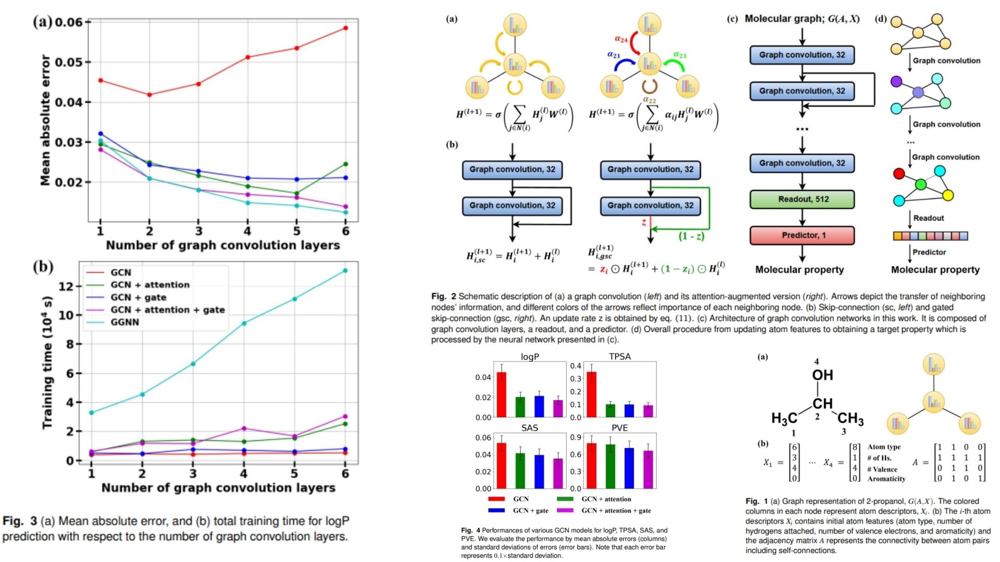

# 🍳 AG-GCN-Replication — Attention-Gated Graph Convolution for Molecular Representation

This repository provides a **forward-only PyTorch replication** of an  
**Attention- and Gate-Augmented Graph Convolutional Network (AG-GCN)** designed
to study how **molecular structure–property relationships** emerge from
attention-weighted graph interactions and gated residual information flow.

The goal is **architectural fidelity rather than benchmarking**: translating the
core mathematical formulation — **attention-guided aggregation, gated
skip-connections, and graph-level readout** — into clear, minimal code without
training pipelines, datasets, or performance tuning.

The emphasis is understanding how:
- Local atomic environments influence learned representations  
- Attention modulates neighbor importance  
- Gated residual paths stabilize deep graph propagation ✦

Paper reference:  [Deeply Learning Molecular Structure-Property Relationships using Attention- and Gate-Augmented Graph Convolutional Networks (arXiv)](https://arxiv.org/abs/1805.10988) ⌬


---

## Overview — Molecular Graph Reasoning ✧



> Molecular properties arise from subtle interactions between atomic structure,
> connectivity patterns, and electronic context.

Standard GCNs treat all neighbors equally, which can blur chemically important
signals. Attention-Gated-GCN instead combines:

- Attention-weighted message passing  
- Adaptive gated skip-connections  
- Graph-level aggregation for property reasoning  

This yields a representation that balances **local specificity** and **global
chemical context** while maintaining stable information flow across layers.

---

## Graph Representation Setting 🧠

A molecule is represented as a graph:

$$
G = (V,E)
$$

with node features:

$$
X \in \mathbb{R}^{N \times d}
$$

where atoms correspond to nodes and bonds define adjacency.

---

## Attention-Augmented Graph Convolution ⚙️

Node embeddings are updated using attention-weighted neighbor aggregation:

$$
h_i^{(l+1)}
= \sigma\!\left(
\sum_{j \in \mathcal{N}(i)}
\alpha_{ij}^{(l)} W^{(l)} h_j^{(l)}
\right)
$$

where:

- $\alpha_{ij}$ represents learned neighbor importance  
- $W^{(l)}$ is a layer-specific weight matrix  
- $\sigma$ is a nonlinear activation  

This allows chemically relevant neighbors to dominate representation updates.

---

## Gated Skip-Connections 🧩

To stabilize deep propagation and prevent information loss, gated residual
connections are introduced:

$$z_i = \sigma(U_1 h_i^{(l+1)} + U_2 h_i^{(l)} + b)$$

$$h_i^{(l+1,gated)}= z_i \odot h_i^{(l+1)}+ (1-z_i)\odot h_i^{(l)}$$

This mechanism:

- Controls how much new information is accepted  
- Preserves useful earlier representations  
- Improves gradient flow across layers  

---

## Graph Readout 🪶

Node embeddings are aggregated into a graph-level representation:

$$
h_G = \sum_{i=1}^{N} h_i
$$

This permutation-invariant summary captures overall molecular structure and
serves as the final representation for downstream reasoning.

---

## Why This Matters 🧪

Attention-Gated-GCN is particularly relevant for:

- Molecular property prediction research  
- Chemical representation learning studies  
- Interpretable graph attention mechanisms  
- Stable deep GNN architecture design  

The architecture illustrates how **chemistry-aware graph inductive biases**
improve structural representation learning.

---

## Repository Structure 🗂️

```bash
Attention-Gated-GCN/
├── src/
│
│   ├── gcn/
│   │   ├── message_functions.py      
│   │   ├── attention_layers.py      
│   │   ├── gated_skip.py             
│   │   └── gcn_core.py              
│
│   ├── chemistry/
│   │   ├── atom_features.py      
│   │   └── graph_builder.py       
│
│   ├── config.py                 
│   └── pipeline.py                  

│
├── images/
│   └── figmix.jpg               
│
├── requirements.txt
└── README.md

```
---


## 🔗 Feedback

For questions or feedback, contact: [barkin.adiguzel@gmail.com](mailto:barkin.adiguzel@gmail.com)
